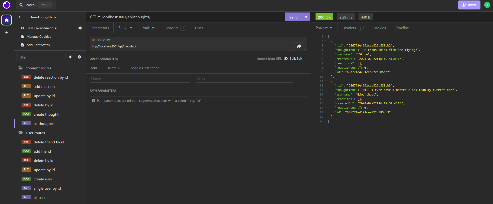

# users-thoughts

## Description
This project is an example of how to interact with mongoDB and models to store data in an API.

Video demo: https://drive.google.com/file/d/1s8bHDhrKvna_qxu7xrLNE3KWWKzHMsrq/view?usp=sharing

## Usage
Boot up the server by running npm start in the command line and open insomnia to interact with the various API routes
to add, delete, and manipulate the stored data.

## Installation
Run npm i in command line to install all relative packages.
Run npm run seed to seed the mongoDB database.

## License
N/A

## Contributors
Ethan Stone